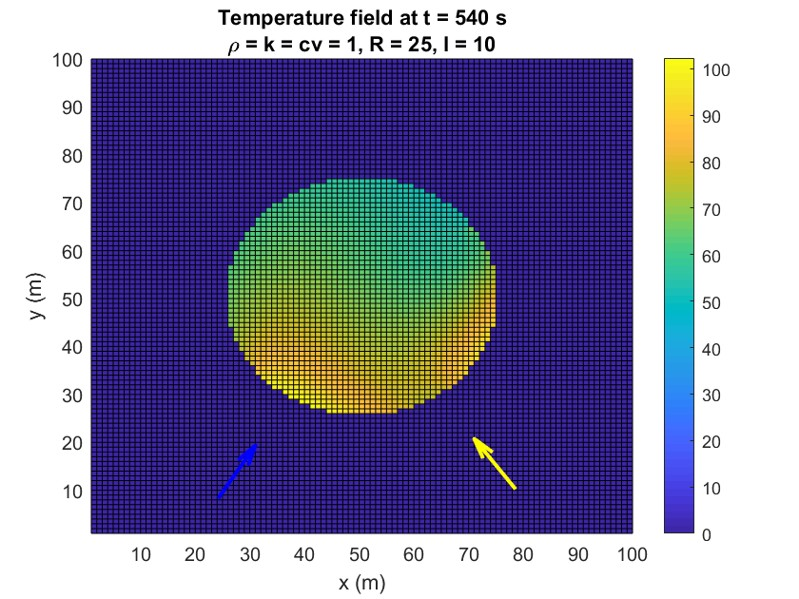
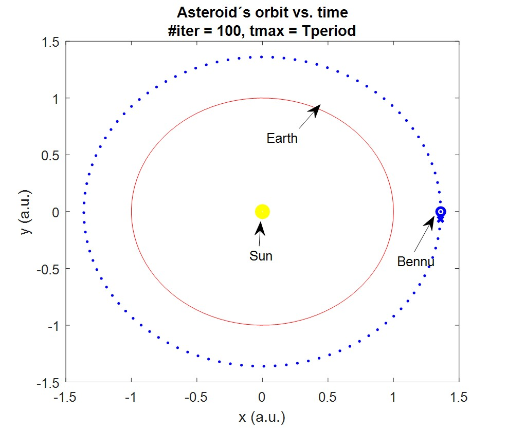
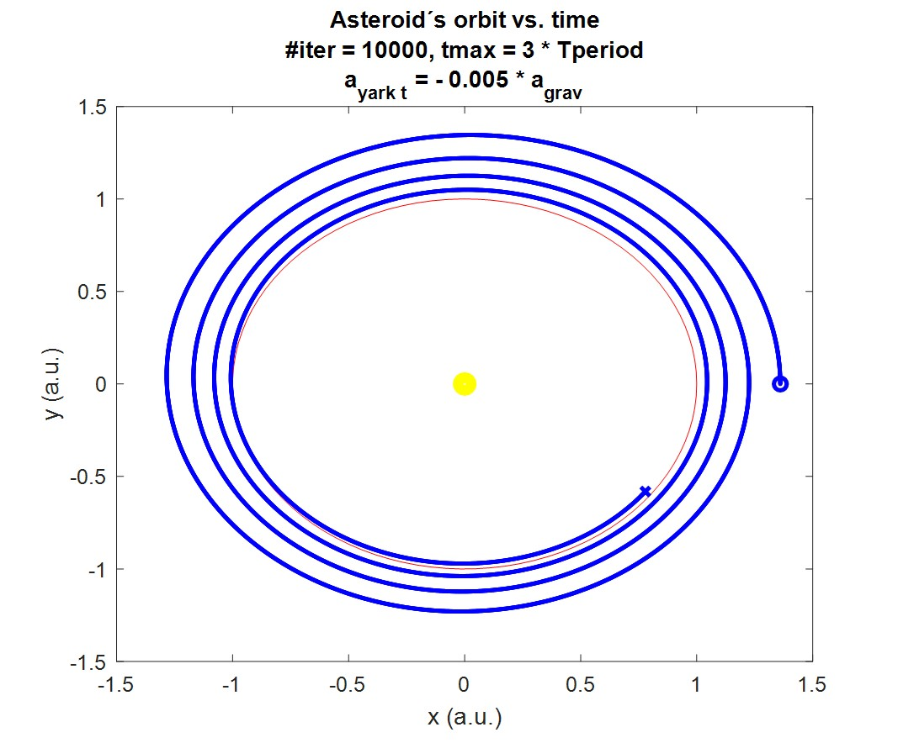

# yarkowsky-effect-simulation
So what killed the dinosaurs? Yarkowsky´s effect, possibly ... also the laws of gravity, abrupt climate change, and much more :)

This repo contains the numerical codes, presentation and files for a simulation of the Yarkowsky effect - a FDM radiative forcing, emission and thermal diffusion simulation + Verlet orbital evolution simulation, done separately.

In essence, a rotating asteroid illuminated by the Sun will have its min/max temperature locations shifted by an angle (rel. to the Sun) simply due to rotation and the finite thermal diffusivity (i.e. things needing time to warm up and cool down) - which in turn leads to thermal photons from blackbody radiation to create an asymmetrical force along/against the orbital motion, and thus push the asteroid away from its orbit and towards the Earth.

For more details, see the presentation and the info on asteroid Bennu and its 1/2000 chance to hit us (the same one from which NASA collected samples and flew them back to Earth in 2024, which is a great story on its own).

TODOs:
1. translate to Python
2. refactor code
3. identify and fix error in boundary conditions handling which causes energy input and thermal energy increase mismatch
4. test vs. theoretical values for simple cases
